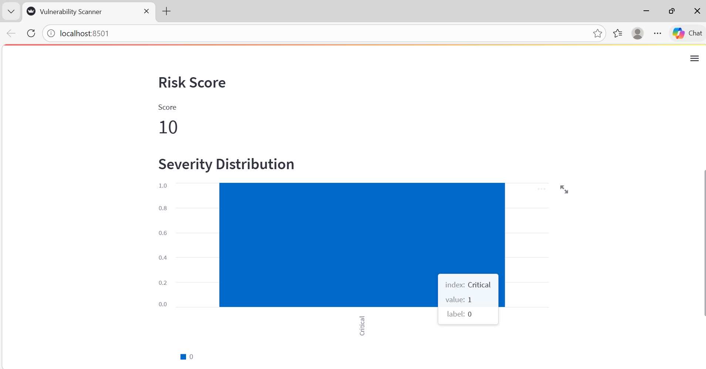
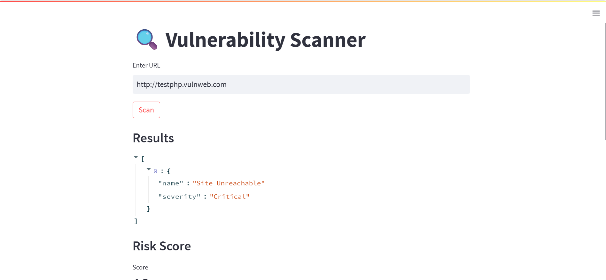
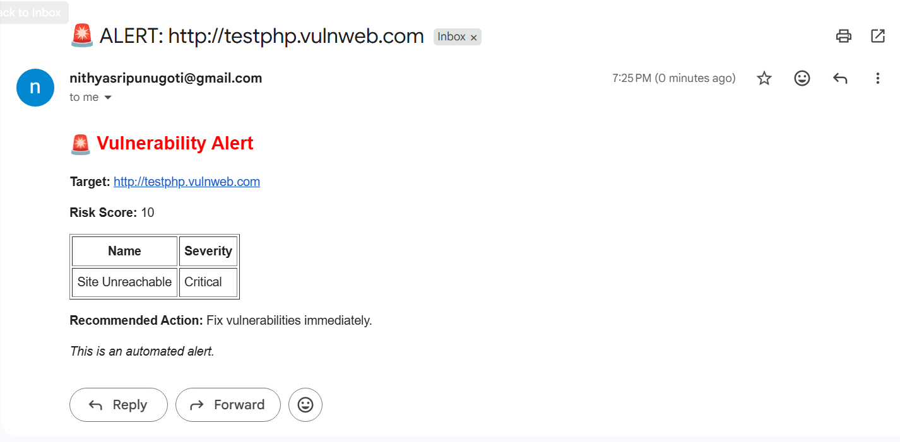

# 🛡️ Web Application Vulnerability Scanner, Risk Evaluation & Email Alert System

## 📌 Overview
This project is a **Web Application Vulnerability Scanner** designed to detect common security issues in a target URL, evaluate the associated risks, visualize the results through an interactive dashboard, and automatically send email alerts for high-risk vulnerabilities.

The system is built as part of a cybersecurity assignment and is intended **only for educational and testing purposes**.

---

## 🚀 Project Components

### 🔍 1. Vulnerability Scanner
The scanner probes a given URL and detects multiple types of vulnerabilities, including:

- SQL Injection
- Cross-Site Scripting (XSS)
- Missing Security Headers
- Open Redirect
- Directory Listing

Each detected vulnerability is assigned a severity level:
- Critical
- High
- Medium
- Low
- Informational

The scanner also handles errors gracefully (e.g., unreachable websites).

---

### 📊 2. Risk Evaluation Dashboard
An interactive dashboard built using Streamlit that:

- Displays detected vulnerabilities
- Shows severity levels
- Calculates an overall **Risk Score**
- Visualizes data using charts (bar graph)

This helps users quickly understand the security posture of the scanned website.

---

### 📧 3. Email Alert System
An automated alert system that:

- Triggers only when **High** or **Critical** vulnerabilities are found
- Sends an HTML-formatted email containing:
  - Target URL
  - Scan timestamp
  - Risk score
  - Summary table of vulnerabilities
  - Recommended actions
  - Disclaimer

---

## 🛠️ Technologies Used

- Python
- Streamlit (Dashboard)
- Requests (HTTP scanning)
- SMTP (Email alerts via Gmail App Password)

---

## ⚙️ Installation & Setup

### 1️⃣ Clone the Repository
```bash
git clone <your-github-link>
cd vulnerability-scanner
```

### 2️⃣ Install Dependencies
```bash
pip install --user -r requirements.txt
```
###3️⃣ Run the Application
```bash
python -m streamlit run dashboard.py
```

---
🌐 Test Environment
```bash
http://testphp.vulnweb.com
```
---
## 📊 Output

The application provides:

- List of detected vulnerabilities  
- Severity classification  
- Risk score calculation  
- Graphical visualization (bar chart)

---
## 📸 Screenshots

### 🔹 Dashboard


### 🔹 Scan Results


### 🔹 Email Alert

---
✅ Folder Structure (IMPORTANT)

vulnerability-scanner/
│
├── screenshots/
│   ├── dashboard.png
│   ├── scan_result.png
│   └── email_alert.png
│
├── scanner.py
├── dashboard.py
├── email_alert.py
├── README.md

---
## 🎯 Conclusion

This project demonstrates a basic yet effective system for:
- Detecting web vulnerabilities  
- Evaluating risk levels  
- Visualizing results using a dashboard  
- Automating email alerts for critical issues  

Future improvements may include:
- Advanced vulnerability detection techniques  
- Integration with tools like OWASP ZAP  
- Authentication-based scanning  